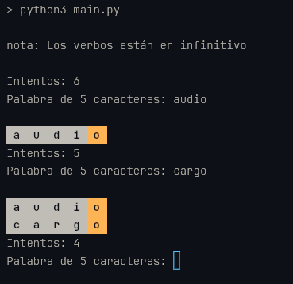

# WordPy: Un Clon de WORDLE en Python

WordPy es una implementación en consola del popular juego de palabras WORDLE, escrito en Python 3. El objetivo es adivinar una palabra oculta en un número limitado de intentos. Después de cada intento, recibirás información que indica qué letras son correctas y están en la posición correcta, cuáles son correctas pero en la posición incorrecta, y cuáles no están en la palabra.

## Instalación

1. Asegúrate de tener Python 3 instalado.

2. Descarga o clona este repositorio.

3. Navega al directorio del proyecto:

    ```bash
    cd wordpy
    ```

4. Ejecuta el script `main.py`:

    ```bash
    python3 main.py
    ```

6. Sigue las instrucciones en pantalla para jugar el juego.

## Diccionario

El juego utiliza `spanish.lst` como su diccionario de palabras. El archivo contiene una lista de palabras en español, una palabra por línea. La configuración predeterminada del juego utiliza solo las palabras de 5 letras.

## Captura de Pantalla


